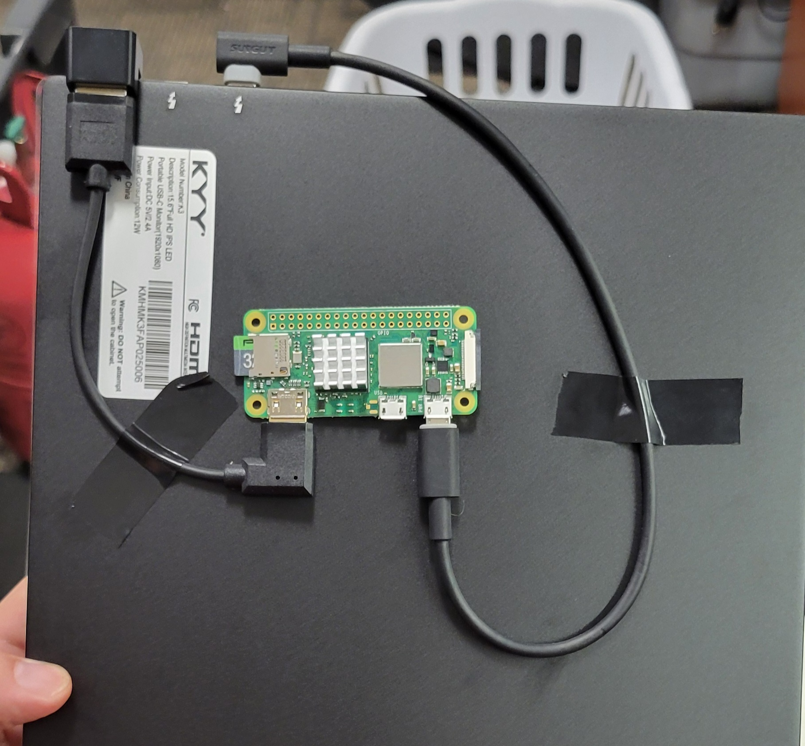
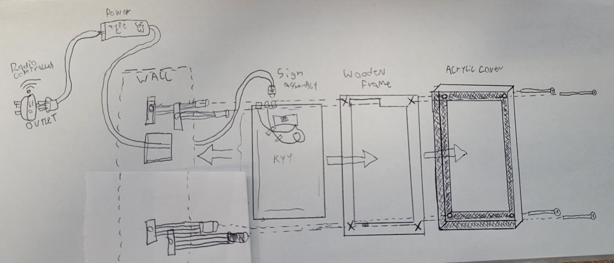

# Hardware

The Live Signage system requires some assembly and bespoke component fabrication. Luckily, if one has access to a laser cutter at their local library or makerspace, this process becomes much easier. This tutorial is ment to be read in its entrirety before the first step is taken. Sign installation sites will need to be evaluated for feasibility before installation of the power delivery system and sign anchor points.

## Gather These First

### Materials Needed

- Opaque Acrylic (Color choice can be used for branding. We used black for a clean look.) at 12" x 19" at 1/8th"

- Clear Acrylic (For replacable screen cover.) also at 12" x 19" at 1/8th

- Glue (G50) Before using this glue, read the detailed discription below. It does not act like normal super glue!

- KYY 15.6" FHD 1080p Portable Laptop Monitor with USB-C and Mini HDMI Support

- Raspberry Pi 0 2 W (This MUST be the 2nd Edition of the Pi0W. The original Pi0W will not have enough resources to run this system! We tried!)

- 65W USB-C Laptop Charger

- 180° Angled Mini HDMI Male to HDMI Female Adapter

- 1' 90° USB C to Micro USB OTG Cable

- 15cm 90° Right Angle Mini HDMI Male to HDMI 2.0 Male Patch Cable

- 11 x 11 x 5.3 mm Anodized Aluminum Heat Sink (You can buy a pack of assorted heat sinks)

- Radio-remote Controlled Power Outlet Adapters. I recommend the Syantek 5 pack on Amazon, as you can have up to 5 seperate live signs on one remote, with a backup to give front facing employees.
  These should be on a band that doesn't have a lot of interference in your area. We use around 430 MHz.

- 1/2" Wood For Frame. If you plan on laser cutting this wood you will need to purchase it from a craft store and not a hardware store. Hardware stores treat their wood with flame-retardant and it makes
  it very difficult to create consistant cuts. You can also use laser cut pieces of 1/16ths inch craft wood that you can then layer, or just CNC the the 1/2' wood frame.

- A Micro SD Card (sometimes called a TF Card) of at least 8Gb from a reputable brand. Almost all the issues we have had with long term system stability can be directly contributed to using cheap after
  market micro SD cards. Use a PNY, Kingston, Samsung, etc.

- 1/4" - 20 Drywall Anchors (The length varies with the depth of your drywall. Ours was 1/2")

### Tools Needed
- A Computer with Windows
- Nitrile Gloves
- Isopropanol in a Spray Bottle
- Clear Cellophane Tape
- A 1/4" Drill Bit Rated for Metal
- A Drywall Saw
- A Drill
- A Drill Bit Set with Phillips Heads
- Washers with a 1/4" Diameter Hole
- A Can of Compressed Air or An Electric Duster
- A Cable Snake
- Electrical Tape
- 3D Printer Filament Snips (A Great Universal Tool!)
- Plastic Rope for Pulling Cable
- A MicroSD to USB Adapter
- A Fan of Some Sort (I used a USB Desk Fan)
- A Ladder
- Another Person

### Software and Files Needed

- Raspberry Pi Imager
- MiniTool Partition Wizard
- Laser Cutter Software (We used LightBurn)
- LightBurn Cut Files OR use provided SVG file with your own laser cutter software
- Putty (Or any SSH program)

## The Process

### Creating Live Sign Units

1. First thing that you need to do is prepare the Operating System for the Live Signs.

2. Insert the MicroSD card into your MicroSD to USB converter and then plug it into your PC.

3. Open MiniTool Partition Wizard and check to make sure you don't have any superfluous partitions. If you do, remove them. After this format the whole card to Fat32. Record the Drive Letter of this new partition.

4. Open Raspberry Pi Imager and hold down Ctrl + Shift + X. This opens the OS Customization Window. Here, configure your signs unique hostname, enter your WiFi credentials, Wireless LAN country, and Enable SSH in the Services Tab. Be sure to remember this password!

5. Then select the Pi 0 2 W as your Board, Select Raspberry Pi OS (other) and in the subsequent menu select Raspberry Pi OS Lite 64-Bit. After that select your Storage Device and then select your MicroSD Card. Confirm that its drive letter is the one you recorded earlier!

6. Once all of these configuration steps have been completed, go ahead and hit next and confirm the write.

7. After the OS has been flashed, slot it into the Raspbery Pi 0 2 W's Micro SD Card slot.

8. Insert the 180° Mini HDMI Male to HDMI Female adapter into the KYY Portable Monitor.

9. Attach the HDMI Patch Cable to the Adapter

10. Attach the other end of the HDMI Patch Cable to the Raspberry Pi's Mini HDMI port.

11. Attach the right angle USB-C Patch Cable to the KYY Portable Monitor on the outside USB-C Port.

12. Attach the other end of the USB-C to Mini USB Patch cable to the PWR Port of the Raspberry Pi.

13. Secure the Pi to the back of the KYY Monitor by using electrical tape over the patch cables.
 This is now the complete Sign Assembly.

14. After that, Plug in the 65W Laptop Charger and allow the Pi to boot. Follow the instructions on the Software side of things in the Main Repo and confirm that your Live Sign is working correctly. I recommend making an image of this working Install so that you can quickly reflash new SD cards if there is ever a hardware failure. 

### Creating Frames and Covers

The Glue that we use here dissolves a portion of the acrylic and binds the 2 pieces being joined together much stronger than the surface bonding of typical super glues. If you use a colored acrylic the glue will take on the color of it. While the glue cures it off-gasses terribly and will react to any oils from you skin still present on the acrylic. This results in unsightly, highly-visible blemishes on the surface of the acrylic. The best way I've found to avoid this is by not removing the standard covering that acrylic sheets ship with, only peeling back the area that needs to be joined and then holding it steady in the L shape with clear scotch tape. For added protection i also had a strong and steady airflow over it to push away the reactive gases. I used a portable solder fume fan's exhaust. 

I recommend leaving the acrylic to bond for at least and hour and a half before you flip it and glue the other seams. I would also recommend that you leave it to cure for 24 hours after the last seam has set. This ensures the whole of the acrylic outer cover is joined as if one object. 

As for the frames, we have provided a lightburn file to cut the wood to shape. you can also use layered acrylic. ultimately it doesn’t matter what the frame looks like as it will be completely encased by the acrylic cover.

## Installation

Once you have all of your parts you are going to want to layer them together. we didn’t provide a hole for the screws in the wood frame as there are tolerance issues with something as irregular as wood. so place the acrylic cover over the wood frame and use a marker to trace the holes. after that take a 1/4'' drill bit and drill straight through it. If you find that the Sign Assembly isn’t exactly flush with the cut out of the cover, use some thin material like foam tape at the bottom of the device to prop it up. There might also be some clearance issues with the power button on the bottom of the screen, Dremel a small slot into that space. It was also left out of the cut file due to it having an irregular placement within the frames.  

### Preparing The Area
Use the clear acrylic cover as a template on the wall to mark where your holes should go. Drill your holes and place the drywall anchors. Cut an additional hole into the drywall slightly above the center point of where the sign will sit and thread the power supply through. In our installation we had power outlets installed above the drop ceiling near the wall, plugged the radio-controlled outlet into that and the 65w usbc charger into that, threading the usbc cable down through the wall and out of the hole cut behind the sign. you will 2 people to install the sign in its final position. it can be done alone but it is very difficult. Clean the inside face and the clear acrylic with alcohol and a micro fiber cloth. use compressed air to clear out any extra dust and handle the entire assembly with rubber gloves to not leave fingerprints. place the clear cover face down with the bolts passing through the holes, place the black acrylic cover over the top of that also passing through the bolts, the wooden frame atop that, and finally the screen assembly. You will have to hold these together as you lift the whole Live Sign upright. Have someone plug in the usbc cable to the power outlet in the screen and then thread the bolts into their respective anchors and begin screwing them in. Be wary of the assembly process as the jostling of the wood, sign, and acrylic might shake dust or saw dust loose and it could fall between the clear cover and the screen of the sign and become unsightly.